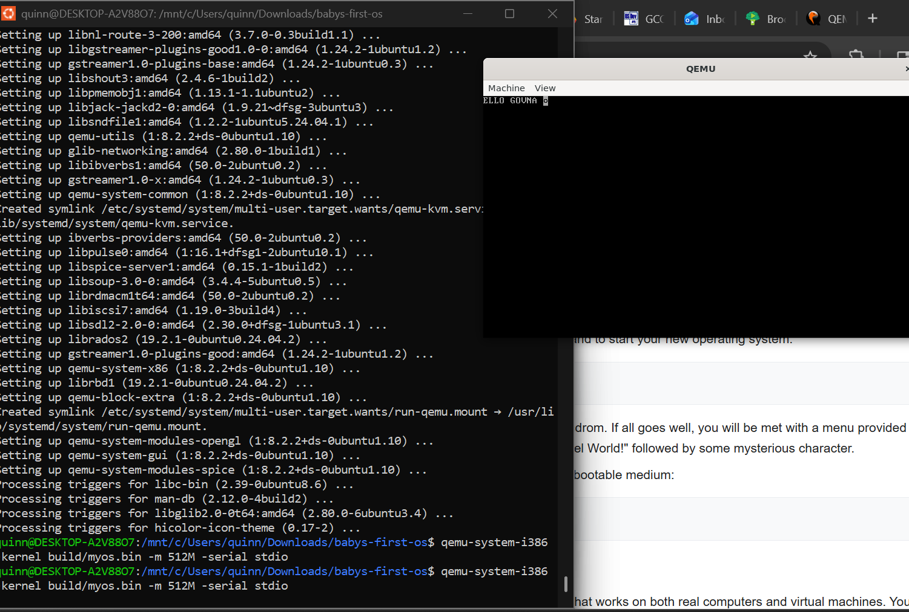
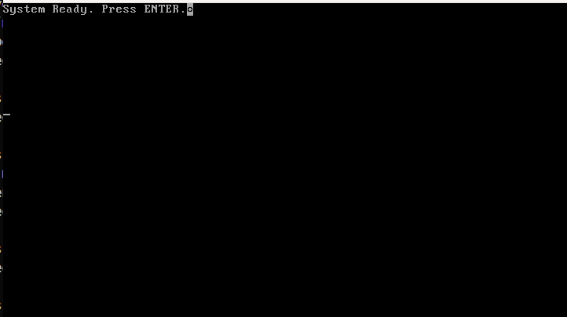
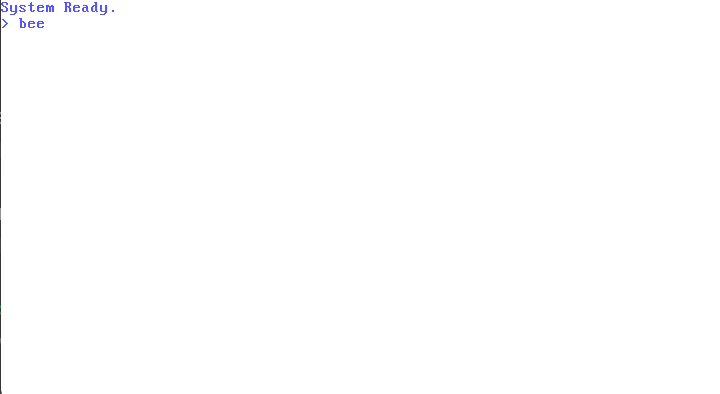

# What is This?

In an attempt to learn more about what goes on behind the endless layers of abstraction.
I will be creating my very own operating system. This README will serve as a kind of documentation on things I learn.
I will be writing down every new discovery, definition and documenting what breaks.
In the beginning I will be using the OSdev Wiki to guide me in creating a 'bare-bones' OS

## 12/01/2025

Today we are compiling! And its successful! I have attached an image below showing what the QEMU virtual machine looks like with the kernel running.

### What I've Learned:

I've learned what bootloaders are. Bootloaders are the first thing that is ran when you power on a computer and it loads the main OS in memeory.
OS development requires a LOT more reasoning than simple web/desktop development where 90% of the effort is on the GUI.
I've also learned that Linux really is the only platform you can realistically develop an operating system.

#### Goals for next session:

Get the OS to play a song

## 12/02/2025

Today I learned a very valuable lesson... You really have to go 10x slower when writing in C. The idea to play a song was WAY too ambitious, but I did make some progress.
I am now able to read keyboard input

### What I've Learned:

I've learned about Global Descriptor Tables, the VM I am using comes pre packages with GDT, but it is apparently a good idea to set up one of your own if you are doing complex tasks 
such as audio input and output. The first GDT entry needs to be Null, the CPU never references this location and it designates the beginning of the table. The two other entries define the kernel code segment
and the kernel data segment. I also implimented a bare bones IDT, ISR and IRQ. The IDT (interrupt descriptor table) is an array of 256 entries index 0-31 are CPU exceptions, the rest are 
software and hardware interrupts, each entry in an IDT says that if this happens or if this 'flag' is hit, jump to this address, in the above snippet the flag is the enter key
and it then prints a return statement. The ISR (interrupt Service Routine) which is an exception handler is the actual code that runs when an interrupt happens. And then the IRQ is the 
hardware interrupt line, it allows you to read input from hardware, for example the IRQ1 line is responsible for the keyboard.

#### Goals for Next Session:

Impliment a simple beep when the enter key is pressed (far more realistic)

## 12/03/2025

Today I decided to take a little bit of a break and just modularize and document a little better, I implimented typing which was fairly simple
Just mapping keys to putting characters in the terminal, tomorrow I hope to spend a little more time on this, documenting and learning more, below I have the typing example!

### What I've Learned:

Now that we are further away from assembly and more towards C, implimenting new changes shouldn't be nearly as dangerous and scary, I didn't study much today but I'll have loads more 
tomorrow!

#### Goals for Next Session:

impliment a buffer so I can have a pseudo command shell, type 'boop' and have your speakers play a beep sound, I will make it more sophistocated as time goes on

## 12/04/2025

Today I finally got the beep to work! Unfortunately I can only upload via GIF so you can't hear it. I also implimented a buffer and commands.

### What I've Learned:

I am starting to understand the flow of interrupts a little bit more. First we need to establish IDT gates, which will be a sort of flag for CPU tasks to execute. The flag in this instance
is the keyboard which is established with: idt_set_gate(33, (uint32_t)irq1, 0x08, 0x8E); in irq.c, then in isr.c we can actually reference this gate when executing something, for example
when this flag is triggered we run keyboard_handle_irq(); which lives in keyboard.h and in that file we impliment our shell and call speaker.c to provide audio output.

#### Goals for Next Session:

I want to be able to import a wav file, but that might be difficult, more research!

